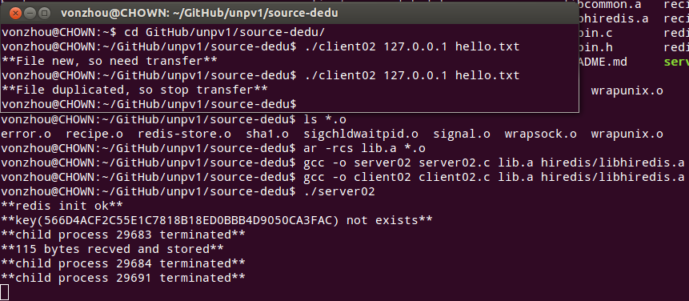
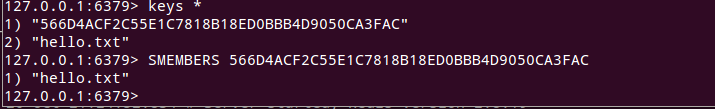
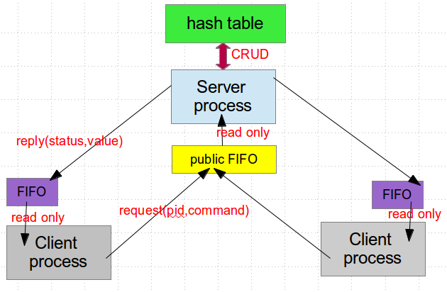
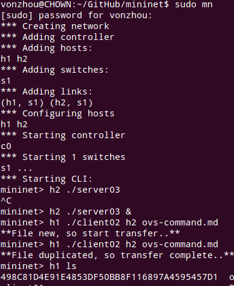
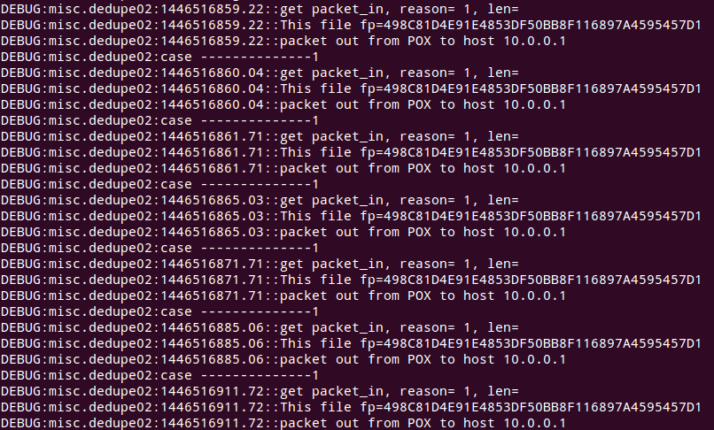

# Source Deduplication
---


## Design

### implementation

0. File level dedu

1. 2 port, fire fingerprint packet to specific tcp port

2. Transfer file to server by fixed chunk.

3. easy way is to use **redis** indexing（file name->fp, fp-> file names） 

4. TCP Nagle probelm





**Solution:**reply the fp packet with something!


### Use own Hash Table 

Server use Redis is not work good in the Mininet host namespace

SO, use hash table

Every client request is processed in a process , so need IPC

Mmap the struct hash table is HARD!!


### Share Data Structure(hash table, dict, list..) btw processes 

A worker process maintain the hash table, and the others send command to it.

struct command{	 request/reply, pid, cmd, key, value, status}

send command use pipe IPC ....




### server03 test



so, the basic flow is ok!


## Add flow entry, let fp packet go to SDN controller

### add flow entry in ovs

let fingerprint packet go to controller

```
sudo ovs-ofctl add-flow s1 tcp,tp_dst=9878,idle_timeout=0,hard_timeout=0,priority=0,actions=controller
```

every tcp packet destinated to the fp port will action to controller including TCP SYN,ACK,FIN , for example


### POX communicate with host

### problem is we can not drop the tcp packet to server, or the client will resend, although the client recv the reply from POX.

 

So use UDP instead, server04, client04


## Use UDP, control every flow

## Test: SDN-based vs. raw

use 10 switches linear topo

* Raw source dedupe in  SDN network, do nothing in controller
* SDN-based dedupe, cache in SDN controller

**test result:**(h1-s1...s10-h2)

sdn controller cache miss : 369.835ms (file new)
sdn controller cache miss : 248.713ms 
sdn controller cache hit : **53.721ms **
sdn controller bloom filter dosnot contain, so file new: **84.167ms**
sdn controller donot dedu  : **127.838**

The cost of cache miss is too big, this is the challenge!!

advantage is not obvious, maybe need more complex network?


## UDP loss packet

client06, server06

so UDP port for fp or control packet and the TCP port for file data packet !

After a time of running, we cannot get reply about whether the fp is redundant, udp packet losss.


## Yes , I return back to TCP for fp and file data , FUCK!


test use dataset sed source code:

| case		|		sed-1.18|	2.05 	|	3.01 	| 3.02  | 4.0.6  | 4.0.7  | 4.0.8  | 4.0.9 | 4.1.1 | 4.1.2 | 
| ---		|   	---		|	---		|	---		|	---	|	---	 |	---	  |	---	   |	---	|	---	|	---	|
| files		| 		0/16 	| 	6/17 	| 	3/143 	| 129/144|126/289|294/306 |218/339 |310/345|236/354|275/354|
| in SDN 	| 688.182ms 	| 442.362 	| 	4634.423| 687.044|4245.047|505.137|3112.064|885.599|3183.998|1940.683|
|SDN cache	|	190.927		| 197.194 	| 	545.917 | 507.189 |1198.739|1074.183|1236.063|1303.264|1374.704|1208.68|


### Test use redis dataset (base-bf-50000)

base_time = (4.5, 0.56, 0.61, 0.58, 0.83, 0.46, 0.44, 0.5, 0.58, 0.51, 0.45, 0.61, 0.51, 0.58, 0.34, 0.47, 2.1, 0.62, 0.66, 0.54, 0.43, 0.41, 0.81, 0.74, 0.73, 0.58, 0.5, 0.51, 0.49, 1.26, 0.55, 0.55, 0.63, 0.63, 0.46, 0.64, 0.52)
files_count = ()


iperf h1 h10
*** Iperf: testing TCP bandwidth between h1 and h10 
*** Results: ['14.4 Gbits/sec', '14.4 Gbits/sec']


### Test use redis dataset (base-bf-50000)  with bandwidth limited 100M

redis_version_number = {1 .. 43}
base_time_100m = (188.13, 98.08, 96.1, 95.14, 95.14, 114.24, 97.46, 98.16, 102.21, 99.1, 101.1, 100.1, 104.64, 102.4, 104.5, 105.7, 99.6, 157.85, 127, 124.9, 117.2, 116.2, 111.2, 129.4, 119.9, 119.5, 117.9, 119, 115.3, 142.1, 120.8, 125, 126.9, 123.1, 124.9, 124.4,  123.8)

files_count 		= (392,393,393,393, 400, 400, 400, 400, 400, 400, 400, 409, 409, 414, 414, 414, 473, 478, 478, 478, 478, 478, 481,  481, 481, 481, 482, 482, 488, 511, 511, 512, 512, 512, 512, 512, 512)
files_deduplicated 	= (8, 377, 386,384, 315, 396, 394, 374, 379, 383, 388, 386, 384, 394, 390, 401, 298, 429, 429, 465, 473, 475, 412, 464, 458, 472, 469, 472, 477, 434, 507, 503, 501, 502, 503, 495, 504)
					(0, 377, 386, 384, 313, 396, 394, 374, 379, 383, 388, 386, 384, 394, 390, 401, 296, 429, 427, 465, 473, 475, 412, 464, 458, 472, 469, 472, 477, 435, 506, 503, 501, 502, 503, 495, 504)

base_time_1000m = (27.5, 12.3, 12.1, 11.9, 14.6, 12.1, 11.9, 12.5, 12.48, 12.17, 12.2, 12.73, 12.68, 12.38, 12.59, 11.91, 19.8, 14.8, 14.97, 14, 13.76, 14.62, 16.4, 14.5, 15, 15.1, 15, 14.4, 14.2, 17.5, 15.15, 15.4, 15.36, 15.43, 15, 14.8, 14.2)

mininet> iperf h1 h10
*** Iperf: testing TCP bandwidth between h1 and h10 
*** Results: ['66.0 Mbits/sec', '74.7 Mbits/sec']

## Mininet bandwidth set cases

1000M, 5ms
mininet> iperf h1 h10
*** Iperf: testing TCP bandwidth between h1 and h10 
*** Results: ['453 Mbits/sec', '455 Mbits/sec']

1000M, 10ms
mininet> iperf h1 h10
*** Iperf: testing TCP bandwidth between h1 and h10 
*** Results: ['121 Mbits/sec', '125 Mbits/sec']

we can see actual bandwidth btw h1 and h10 = A/B


## TODO 

Connect localhost socket in mininet host

Add file set not a single file, count time (done)

Customized topology in pox (done)

test file level ()

file CDC ()

https://msdn.microsoft.com/en-us/library/bb727086.aspx

log 2015-12-17


vonzhou 2015.10.26


(update 2016.5.4)

## Topology size vs backup time

linear 10,15,20

dataset redis 37 versions (Not Good !!)

bandwidth 1Gb/s (iperf = 822Mbits/s)

bloom filter size = 50K

linear_10 = (3.58, 2.35, 2.32, 3.43, 2.86, 2.57, 2.47, 2.69, 2.64, 2.56, 2.89, 2.94, 2.69, 2.5, 2.48, 2.51, 3.47, 3.71, 3.1, 2.85, 2.78, 2.75, 3.1, 2.85, 3.16, 2.5, 2.59, 2.5, 2.46, 3.16, 2.6, 2.66, 2.79, 2.79, 2.67, 2.73, 2.74)

linear_15 = (4.07, 2.71, 2.59, 2.69, 3.84, 2.88, 2.91, 3.05, 3.05, 2.72, 2.51, 2.59, 2.68, 2.55, 2.6, 2.46, 3.78, 3.08, 3.34, 2.93, 2.76, 2.6, 3.38, 2.74, 3.13, 2.81, 2.96, 2.95, 3.24, 4.43, 3.38, 3.45, 3.82, 3.66, 3.56, 3.38, 3.3)

linear_20 = (5.38, 2.75, 2.83, 2.84, 3.75, 2.69, 2.49, 2.79, 2.69, 2.63, 2.62, 2.54, 2.81, 2.6, 2.62, 2.51, 4.4, 3.23, 3.52, 3.02, 2.66, 2.58, 3.65, 2.75, 3.1, 2.81, 2.98, 2.81, 2.7, 3.87, 2.86, 2.95, 3.16, 3.15, 2.99, 3.25,2.97)

dataset kernel 100 versions

linear10 = ()

linear20 = (6.827099, 7.655737, 6.79125, 6.177505, 4.108141, 3.72987, 6.233409, 5.39454, 5.866327, 6.265652, 3.654973, 5.013348, 5.127478, 4.857921, 4.406175, 7.341958, 10.312775, 5.967133, 6.367923, 5.76466, 6.661209, 7.724515, 7.941016, 7.695566, 5.117914, 5.977343, 7.270101, 5.277658, 6.962171, 7.194754, 7.165532, 6.253941, 6.926282, 27.183454, 14.100484, 7.179771, 7.499729, 12.441298, 10.038568, 9.054949, 9.854753, 6.401131, 8.044223, 9.821045, 6.05421, 7.820636, 9.425864, 11.706048, 9.691339, 10.150015, 9.354521, 10.803509, 12.31989, 11.757399, 11.418682, 8.389818, 9.017334, 8.014273, 9.399023, 9.056969, 13.575228, 12.681219, 11.1813, 10.766319, 9.711551, 9.469737, 7.946171, 14.720181, 13.417327, 11.335119, 18.140428, 13.381444, 12.360237, 13.579837, 10.54859, 11.284365, 15.427327, 7.221815, 10.599053, 11.28019, 17.923047, 16.393996, 15.058033, 35.818262, 16.544203, 14.408534, 11.76849, 11.371337, 12.620377, 12.881193, 13.788636, 17.633827, 16.739037, 18.931919, 20.056681, 29.716209, 27.102792, 36.04435, 22.362486, 25.411755)


linear30 = (7.580136, 6.857717, 6.775111, 5.826816, 5.359253, 4.903776, 8.435962, 7.313498, 6.463922, 7.026804, 5.027253, 7.551994, 6.472148, 6.429621, 5.839139, 6.189971, 8.217053, 6.047832, 10.232897, 9.483607, 8.97151, 6.280837, 7.388099, 6.759419, 6.79528, 7.354843, 9.378843, 6.749932, 8.276044, 7.568858, 8.232939, 7.731701, 11.308925, 34.056028, 18.278692, 9.059759, 10.007011, 13.394216, 9.652422, 9.672993, 11.210351, 8.791491, 10.932735, 13.321455, 8.676724, 11.98128, 10.677786, 12.361182, 12.739844, 13.156138, 13.515822, 12.70371, 16.052922, 14.352414, 13.530931, 9.046652, 12.859787, 11.283071, 12.559112, 11.754065, 14.201328, 13.547537, 12.224962, 15.523466, 14.639189, 14.124139, 11.679667, 20.330662, 17.666674, 14.573629, 14.848791, 14.941557, 13.368044, 16.073218, 16.120838, 16.197841, 21.312627, 9.703442, 14.889776, 16.375694, 19.4244, 17.309536, 16.37638, 44.830442, 19.173966, 17.467204, 19.24769, 14.989642, 17.307525, 17.238145, 19.296605, 19.371648, 18.302158, 24.518322, 24.153927, 35.370263, 38.950427, 47.373788, 29.858253, 33.409677)

```
mininet> iperf h1 h30
*** Iperf: testing TCP bandwidth between h1 and h30 
*** Results: ['426 Mbits/sec', '430 Mbits/sec']
```

## Steps

```bash
cd openvswitch-2.3.2/   # start ovs 

sh start_ovs.sh

ps -axu | grep ovs

cd redis-3.0.5/     # before sdn controller start redis server

./src/redis-server # if change maxmemory config, then ./redis-server redis.conf


cd pox/			# start sdn controller

./pox.py log.level --DEBUG pox.dedu.dedupe06

cd mininet/    # start mininet

sh start_mn.sh

iperf h1 h10

./init_flow_15_switches.sh    # add flows to switch use bash !!

cd source-dedu/   # compile

sh make10.sh

h15 ./server10    # start backup server

h1 ./client09      # client backup a version

```

## base vs bloom vs sdna

bloom_time = (35.765523, 26.453468, 22.883979, 21.731732, 22.489979, 21.537492, 31.929076, 27.855623, 25.235594, 31.46871, 21.673251, 26.401616, 26.691423, 26.908995, 26.147263, 31.852807, 33.613421, 28.404776, 33.978788, 29.987875, 36.644197, 30.184784, 31.779378, 31.011205, 30.615092, 29.416486, 31.236977, 27.513617, 28.700867, 27.873964, 28.68733, 28.766479, 38.908027, 123.719097, 57.091459, 37.475081, 37.238067, 38.703803, 35.885004, 37.854918, 41.520075, 36.438873, 39.907921, 42.896529, 30.644142, 38.992989, 39.924861, 42.630125, 41.132352, 42.104291, 43.584525, 41.858552, 45.797388, 45.954885, 46.310976, 35.023156, 45.374516, 44.630735, 43.150214, 41.102226, 48.21789, 50.551962, 48.042553, 49.153552, 43.728516, 43.888186, 34.308481, 54.830146, 56.279654, 53.347396, 47.887271, 49.786399, 46.763056, 54.228268, 51.565933, 53.796634, 53.360697, 35.23872, 52.366571, 53.745246, 63.7343, 57.264509, 56.021158, 87.566837, 65.929354, 64.886088, 58.182285, 58.30802, 61.780722, 62.011971, 62.641529, 61.526226, 59.157385, 64.952838, 65.156069, 72.930617, 72.068779, 86.590031, 77.115298, 77.262428)


