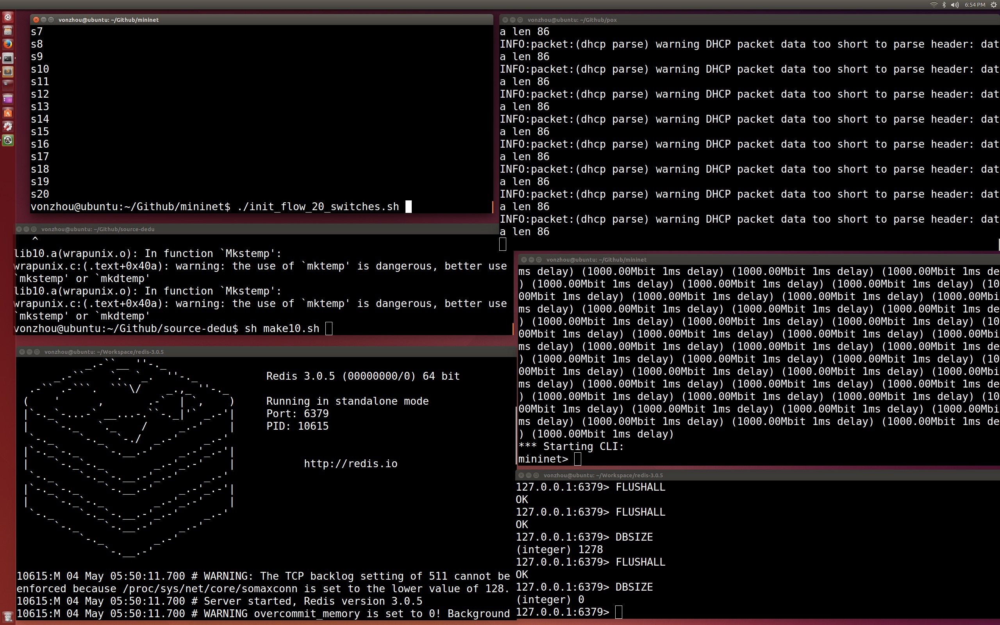

# 系统帮助说明
---


## 设计

参见设计文档。

## 环境

### OS

```bash
➜  ~ uname -a
Linux ubuntu 3.13.0-32-generic #57-Ubuntu SMP Tue Jul 15 03:51:08 UTC 2014 x86_64 x86_64 x86_64 GNU/Linux
```

### SDN

**1. Open vSwitch**

```bash
➜  ~ sudo ovs-vsctl --version
ovs-vsctl (Open vSwitch) 2.3.2
Compiled Feb 25 2016 00:59:19
DB Schema 7.6.2
```

**2. SDN Controller： POX**

### 测试数据集

* Linux kernel的100个版本
* redis server的37个版本

## 运行

* 启动OVS

```bash
cd openvswitch-2.3.2/   

sh start_ovs.sh

ps -axu | grep ovs
```

* 启动redis server， POX controller需要，缓存指纹

```bash
cd redis-3.0.5/     # before sdn controller start redis server

./src/redis-server # if change maxmemory config, then ./redis-server redis.conf
```

* 启动POX，指定我们实现的模块 pox.dedu.dedupe06

```bash
cd pox/			# start sdn controller

./pox.py log.level --DEBUG pox.dedu.dedupe06
```

* 启动Mininet

```bash
cd mininet/    
sh start_mn.sh

iperf h1 h10

```

* 修改流表

```bash
./init_flow_15_switches.sh    # add flows to switch use bash !!
```

* 编译client，server

```bash
cd source-dedu/   # compile
sh make10.sh
```

```c
NXST_FLOW reply (xid=0x4):
 cookie=0x0, duration=2764.494s, table=0, n_packets=398, n_bytes=29001, idle_age=2755, priority=65535,tcp,in_port=2,vlan_tci=0x0000,dl_src=00:00:00:00:00:0a,dl_dst=00:00:00:00:00:01,nw_src=10.0.0.10,nw_dst=10.0.0.1,nw_tos=0,tp_src=9877,tp_dst=35864 actions=output:1
 cookie=0x0, duration=2507.658s, table=0, n_packets=2439, n_bytes=2727574, idle_age=2480, priority=65535,tcp,in_port=1,vlan_tci=0x0000,dl_src=00:00:00:00:00:01,dl_dst=00:00:00:00:00:0a,nw_src=10.0.0.1,nw_dst=10.0.0.10,nw_tos=0,tp_src=35865,tp_dst=9877 actions=output:2
 cookie=0x0, duration=2507.616s, table=0, n_packets=1639, n_bytes=111866, idle_age=2480, priority=65535,tcp,in_port=2,vlan_tci=0x0000,dl_src=00:00:00:00:00:0a,dl_dst=00:00:00:00:00:01,nw_src=10.0.0.10,nw_dst=10.0.0.1,nw_tos=0,tp_src=9877,tp_dst=35865 actions=output:1
 cookie=0x0, duration=2989.637s, table=0, n_packets=1746, n_bytes=2095584, idle_age=2970, priority=65535,tcp,in_port=1,vlan_tci=0x0000,dl_src=00:00:00:00:00:01,dl_dst=00:00:00:00:00:0a,nw_src=10.0.0.1,nw_dst=10.0.0.10,nw_tos=0,tp_src=35863,tp_dst=9877 actions=output:2
 cookie=0x0, duration=2764.549s, table=0, n_packets=496, n_bytes=326584, idle_age=2755, priority=65535,tcp,in_port=1,vlan_tci=0x0000,dl_src=00:00:00:00:00:01,dl_dst=00:00:00:00:00:0a,nw_src=10.0.0.1,nw_dst=10.0.0.10,nw_tos=0,tp_src=35864,tp_dst=9877 actions=output:2
 cookie=0x0, duration=64.768s, table=0, n_packets=3294, n_bytes=3953877, idle_age=36, priority=65535,tcp,in_port=1,vlan_tci=0x0000,dl_src=00:00:00:00:00:01,dl_dst=00:00:00:00:00:0a,nw_src=10.0.0.1,nw_dst=10.0.0.10,nw_tos=0,tp_src=35866,tp_dst=9877 actions=output:2
 cookie=0x0, duration=64.697s, table=0, n_packets=2078, n_bytes=140930, idle_age=36, priority=65535,tcp,in_port=2,vlan_tci=0x0000,dl_src=00:00:00:00:00:0a,dl_dst=00:00:00:00:00:01,nw_src=10.0.0.10,nw_dst=10.0.0.1,nw_tos=0,tp_src=9877,tp_dst=35866 actions=output:1
 cookie=0x0, duration=2989.544s, table=0, n_packets=1174, n_bytes=78288, idle_age=2970, priority=65535,tcp,in_port=2,vlan_tci=0x0000,dl_src=00:00:00:00:00:0a,dl_dst=00:00:00:00:00:01,nw_src=10.0.0.10,nw_dst=10.0.0.1,nw_tos=0,tp_src=9877,tp_dst=35863 actions=output:1
 cookie=0x0, duration=3271.945s, table=0, n_packets=0, n_bytes=0, idle_age=3271, udp,tp_dst=68 actions=drop
 cookie=0x0, duration=3271.027s, table=0, n_packets=0, n_bytes=0, idle_age=3271, priority=0,udp,tp_dst=9877 actions=CONTROLLER:65535
 cookie=0x0, duration=3271.934s, table=0, n_packets=143, n_bytes=48906, idle_age=196, udp,tp_dst=67 actions=drop
 cookie=0x0, duration=2989.680s, table=0, n_packets=0, n_bytes=0, idle_age=2989, priority=65535,arp,in_port=2,vlan_tci=0x0000,dl_src=00:00:00:00:00:0a,dl_dst=00:00:00:00:00:01,arp_spa=10.0.0.10,arp_tpa=10.0.0.1,arp_op=2 actions=output:1
 cookie=0x0, duration=3271.972s, table=0, n_packets=988, n_bytes=130124, idle_age=53, ipv6 actions=drop
```

* 在Mininet的两个host中分别运行client，server

```bash
h15 ./server10  &  # start backup server
h1 ./client09      # client backup a version
```

* 备份完成后，统计信息

```bash
➜  SdnBasedDeduplication git:(master) cd test              
➜  test git:(master) python extract_log.py 
Enter file name: kernel_sdna_cache_800k
--------------------------dedu time-------------------
[4.008264, 3.943874, 4.339101, 3.975689, 3.926724, 3.859574, 4.778007, 4.488389, 4.231914, 4.418918, 4.195945, 4.702788, 5.734566, 4.580693, 4.499628, 4.762909, 5.24696, 4.846964, 5.663082, 4.968633, 5.272255, 4.695161, 4.866314, 4.695586, 4.698431, 4.963016, 5.658102, 4.764334, 4.988954, 4.614567, 4.846316, 4.713139, 5.688324, 15.445399, 27.535297, 20.677558, 19.383036, 21.324289, 18.953932, 19.879203, 20.010588, 17.28086, 18.208451, 19.364916, 34.864549, 17.138319, 18.326486, 18.667829, 19.465755, 20.262784, 20.249425, 20.318964, 21.874531, 24.074825, 24.820009, 33.118647, 23.71087, 21.666799, 23.944867, 22.526474, 26.710171, 28.052541, 26.314192, 27.369413, 26.237364, 26.938115, 35.9486, 33.591101, 34.180185, 32.81941, 33.208255, 35.12703, 31.673467, 35.718749, 33.877988, 37.123852, 47.18931, 36.929817, 41.259977, 44.581518, 56.894743, 60.041606, 60.394941, 69.795629, 51.483234, 47.983144, 48.390903, 48.424277, 47.338305, 47.171521, 48.308821, 48.362543, 46.641551, 56.00155, 48.724354, 55.599379, 54.392824, 57.586435, 47.300062, 47.578204]
--------------------------file count------------------
[561, 598, 603, 608, 620, 637, 667, 671, 676, 688, 690, 707, 711, 729, 740, 766, 783, 795, 860, 868, 886, 890, 898, 905, 905, 907, 908, 908, 909, 909, 909, 908, 991, 1943, 1119, 1121, 1121, 1122, 1123, 1125, 1134, 1134, 1141, 1145, 1003, 1153, 1163, 1178, 1209, 1214, 1213, 1215, 1248, 1314, 1357, 1059, 1363, 1370, 1392, 1394, 1410, 1439, 1449, 1454, 1454, 1458, 1064, 1507, 1568, 1576, 1582, 1600, 1600, 1625, 1633, 1642, 1642, 1102, 1645, 1661, 1925, 1933, 1937, 2017, 2020, 2021, 2021, 2021, 2024, 2026, 2031, 2031, 2031, 2021, 2039, 2124, 2175, 2301, 2347, 2351]
---------------------------file new count-------------
[0, 0, 0, 0, 0, 0, 1, 0, 0, 0, 0, 0, 0, 1, 0, 0, 1, 0, 0, 2, 1, 0, 0, 0, 0, 1, 2, 1, 0, 0, 3, 0, 1, 13, 22, 8, 5, 11, 4, 4, 10, 2, 7, 13, 6, 9, 9, 8, 10, 15, 11, 14, 24, 17, 16, 8, 12, 5, 10, 9, 18, 17, 12, 20, 10, 16, 12, 35, 35, 18, 22, 22, 6, 21, 16, 17, 37, 13, 14, 17, 35, 17, 14, 160, 28, 15, 12, 6, 15, 13, 24, 23, 16, 42, 47, 111, 110, 171, 67, 104]
----------------------------file new count from pox---
[561, 319, 202, 96, 102, 63, 328, 187, 146, 142, 16, 139, 140, 129, 97, 96, 233, 119, 212, 138, 266, 91, 129, 89, 75, 130, 165, 18, 34, 15, 15, 9, 307, 1806, 597, 79, 79, 195, 120, 148, 190, 64, 146, 187, 58, 103, 118, 185, 194, 223, 182, 118, 204, 169, 130, 74, 95, 69, 111, 34, 193, 171, 99, 111, 80, 85, 120, 232, 217, 146, 82, 135, 31, 117, 33, 96, 204, 40, 41, 67, 212, 85, 44, 566, 99, 78, 32, 38, 50, 51, 56, 68, 45, 116, 98, 303, 240, 377, 158, 192]
----------------------------average dedu ratio--------
0.852354046734
```


## 参数配置

### 配置client/server的去重方法

```bash
$ ./client <server_ip_addr> [base/bloom/sdna] <backup_dir>
$ ./server -m [bloom/sdna]
```


### Bloom Filter大小

需要在程序中修改，server, SDN Controller 

### Cache大小

修改SDN Controller使用的redis server的内存配置(redis.conf)，maxmemory以及替换策略

```bash
maxmemory 1MB
maxmemory-policy allkeys-lru
```

### 带宽大小

在启动Mininet时候配置, bw带宽，delay时延

```bash
sudo mn --topo=linear,20 --link tc,bw=1000,delay=1ms --mac --switch=ovsk --controller=remote,ip=127.0.0.1
```

### 网络规模

在启动Mininet时候配置,配置OVS个数

```bash
sudo mn --topo=linear,40 --link tc,bw=1000,delay=1ms --mac --switch=ovsk --controller=remote,ip=127.0.0.1
```

## 运行截图




